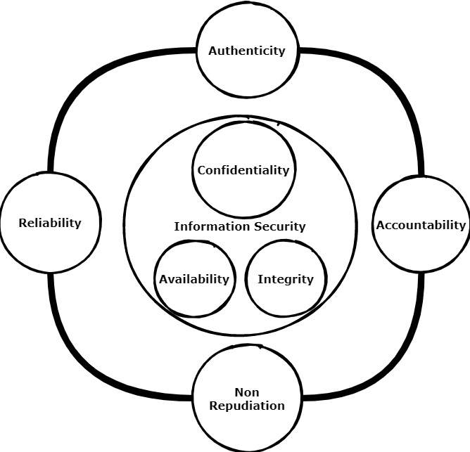
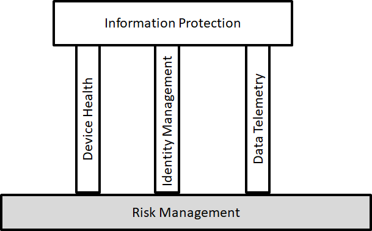
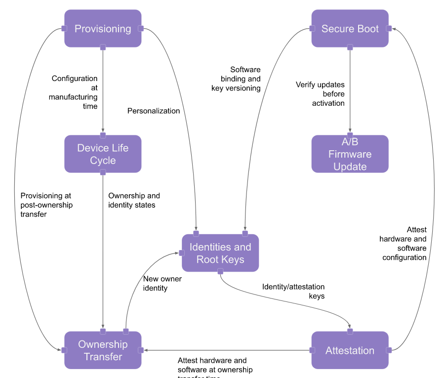

# Security Models

The essence of information security is to protect information. It is
just that simple. Do not make it more complicated. 

Complexity for cyber security and privacy arise when information needs to be shared or must be made accessible. 

Proven security architecture and models help when creating a solution for your use case.


```{tip} Reuse Security Models 
Save time and money: Reuse existing open security models!


*Adjusting an existing models for your problem situation saves time and improves the quality for your solution!*
```

A good visualization of a security model is easy to use for communication. So instead of explaining what the essence of information security is: Use a model to facilitate crucial conversations.




The essence of information security is to protect information. It is
just that simple. So whenever possible do not make it more complicated
than needed. Complexity for cyber security and privacy arise when
information needs to be shared or must be made accessible by some
digital device. The world where information was only available in
physical archives is long gone. The focus from physical information
security is shifted to cyber information security. But be aware: Crucial
principles of centuries of physical information protection are still
valuable today. Especially principles related to the intangible soft
issues when information is shared. Ever wondered how some organizations
managed to keep their valuable information secret for many decades?

Information protection is needed against:
*  unauthorized access
*  use
* disclosure 
* modification or
*  destruction. 
That means several security
measures are needed to protect information from unauthorized viewers.


Measures can be implemented by procedural, physical or with complex IT
tools. But before classifying and creating or finding good measures it
is essential that the problem field is made clear.

Creating effective solutions for information security problems can be
done by creating a model of the problem situation. Within a model all
elements that relate with the problem situation are brought together to
study effective solutions. Without going into detail on system science
or problem solving theory: in general systems consist of sub-systems,
objects, functions or processes, and activities or tasks.

The key in creating a good model to solve a specific information
security problem is to model the problem, not the complete system with
all elements. This because modelling the world completely is
ineffective, time consuming and it does not give a direct answer to
solve a problem situation. It is far better to start with a small model
of a problem and create extensions on this model if needed.

The field of modelling problem situations to solve information security
problems is not new. Many models in literature exist. Reusing a good
model can save you time and safeguards you from making mistakes. A
prerequisite is that you start with a good model that can be trusted and
is intensively reviewed by large numbers of subject matter experts.

There are many good security models that can assist in creating a
solution architecture to solve a specific security problem for an
organization. Mind that a model can be expressed in many different
forms. E.g.:

-   One or more images;
-   Text;
-   Software model

Within the field of modelling a distinction can be made between ‘hard’
and ‘soft’ models. Hard models are often mathematical (risk) models
whereas soft models are more quality based models. Since using hard
models often gives a false sense of reliability and requires full
insight of all assumptions made it is more productive to reuse soft
security and privacy models. When creating solution architecture, you
need:

-   A threat model (what are the threats your solution gives protection
    against)
-   Insight in commonly used attack vectors. This means you need to have
    some view on the attack vectors used in the use case? 



Creating a good security or privacy design or architecture means you
never ever start with selecting tools for solving your problem!
Selecting tools should be the last phase of your security or privacy
design phase. You select tools when it is clear how that the tool
supports you in solving your security or privacy problem. Tools alone
are never enough to solve security or privacy problems. You need to fit
in tools within your security and privacy processes. Several problems
exist and arise with many IT security tools that hit you when you start
too soon with a focus on solutions instead of a thorough problem
diagnosis and solution design. Wrongly selected security and privacy
tools give the following issues:

-   High costs;
-   Complex challenges to implement and manage;
-   Daily administration of a chosen tool set requires significant IT
    effort while it remains unclear if the tools are effective in
    reducing security risk;
-   Overlap in functionality of security application landscape. More is
    not always better. To be able to justify the application of security
    tools for your problem a context specific security architecture
    should give input to the following questions:
    -   What is protected with what?
    -   What are the main threats we need protection against?
    -   What is not protected by information security policies or tools?
    -   What is in scope or out of scope for your security architecture?
        E.g. business continuity management, safety management,
        financial risk management, daily IT operations, physical
        (building) security etc. In the end everything has a relation
        with information security, but you cannot cover all business
        aspects using an information security architecture document. The
        key is to focus and keep the scope clear or else the complexity
        becomes overwhelming.
    -   What architecture or design decisions have been made and must be
        validated explicitly?
    -   What is the model of your protection? It is far more easy to
        evaluate and improve a model, than adding new or improved
        security products continuously. Make sure that within
        operational security management processes learning and improving
        are key periodic targets.
    -   Does the security model cover all crucial security and privacy
        principles and requirements?
    -   Are the residual risks when this solution acceptable for the key
        stakeholders?

IT security in general is seen as a complex problem field, due to the
many technical and nontechnical aspects involved. Since 100% information
security is impossible, being able to qualify risks is crucial in
getting an accepted level of security protection. Good modelling helps
you to qualify security and privacy risks.

In general, it is far more easy to reuse proven concepts and models when
creating your own security model. This way you build on the work of
others and using a good model reference reduces the risk of making
crucial mistakes.


## ATT&CK

ATT&CK stands for Adversarial Tactics, Techniques, and Common Knowledge.
[MITRE](https://www.mitre.org/)  started this project in 2013.

ATT&CK is largely a knowledge base of adversarial techniques — a
breakdown and classification of offensively oriented actions that can be
used against particular platforms, such as Windows. Unlike prior work in
this area, the focus isn’t on the tools and malware that adversaries use
but on how they interact with systems during an operation.

The relationship between tactics and techniques can be visualized in the
ATT&CK Matrix.

The ATT&CK Matrix is probably the most widely recognizable aspect of
ATT&CK because it’s commonly used to show things like defensive coverage
of an environment, detection capabilities in security products, and
results of an incident or red team engagement.

The complete Matrix and all guides and information can be found at:
https://attack.mitre.org/


## Car Hacking

Modelling how things really work is the best start for good protection.
So any investment or use of real world hacking modles improves your
security design.

Cars and especially autonomous cars are trending. Cars are nowadays also
almost computers on wheels. In order to make sure it's safe, secure and
vendors do not mess with your privacy hacking cars should not be a crime
but should be encouraged. Since most advanced cars are build upon OSS
software security and privacy has increased significantly.

To know how secure cars are, use:

The Car Hackers Handbook: <http://opengarages.org/handbook/> This Car
Hackers Handbook helps you create better threat models for vehicles.
Also your knowledge on how cars work increases per page.

## Industrial Internet Reference Architecture

The IIRA is a standards-based reference architecture. It is a good reference to use when working in a IoT or industrial context.
It is aimed at system architects to make their own design  faster and better by using a common framework and concepts.

Check: https://www.iiconsortium.org/IIRA.htm

Or see the PDF-book at: https://www.iiconsortium.org/pdf/IIRA-v1.9.pdf 

*note:IIRA is **NOT** open access*


## Jericho Security Model

The Jericho(tm) Security architecture model is built upon principles.
The advantages of using the Jericho model for security are:

-   A security architecture model built upon the Jericho conceptual
    model is built around maintaining flexibility and protects the most
    important security objects for the stakeholders.
-   Integration: Easier to build secure processes with other companies
    and trusted partners.
-   Simplifies use of public networks and cloud solutions
-   Aimed for use of open principles and open solution building blocks.


Unfortunate the Jericho framework is not a real open security framework.
It is copyrighted by the open group (see references chapter for more
information on this model). There are trademarks involved and all
publications are copyrighted. However due to the work of many we can
make use of the developed knowledge within the Jericho working group.
The Jericho Forum®, a forum of The Open Group, was formed in January
2004 and is no longer active. However, the approach of this forum
towards security is still alive.


## NIST:Cloud Computing Security model

Sooner or later you create a solution or privacy architecture where
cloud hosting plays a significant part. The NIST cloud computing
security reference model is a very good model to use as reference. 


## Open Security Architecture Landscape(OSA)

Thanks to the Open Security Architecture (OSA) group there is a real
open security landscape: https://www.opensecurityarchitecture.org/.

All OSA material is CC by sa licensed, which means you can freely use
and improve it.

Below is the OSA Security architecture landscape:


Link to OSA: https://www.opensecurityarchitecture.org

The OSA Security architecture is based on patterns. Which mean for every
pattern defined the aim of the community was/is to develop a
standardized solution description. Unfortunate the OSA community is not
very active anymore, so all IT security patterns around cloud are not
yet incorporated.

For a number of reasons we have chosen not to use patterns in this
security and privacy reference architecture. However in some cases using
patterns can give an advantage. (See the Introduction, section 'What
about security patterns?' for more information).

## OpenTitan Security Model 

OpenTitan is an open source project for building a transparent, high-quality reference design and integration guidelines for silicon root of trust (RoT) chips.  

OpenTitan will make the silicon RoT design and implementation more transparent, trustworthy, and secure for enterprises, platform providers, and chip manufacturers. OpenTitan is administered by lowRISC CIC as a collaborative project to produce high quality, open IP for instantiation as a full-featured product. 



*([Image source](https://docs.opentitan.org/doc/security/specs/) - license: Apache License, Version 2.0)* 

Link for info on Open Titan project: [https://opentitan.org/](https://opentitan.org/) or see the docs at [https://docs.opentitan.org/)https://docs.opentitan.org/](https://docs.opentitan.org/)https://docs.opentitan.org/)

## System Transparency architecture

System Transparency is a security architecture for bare-metal servers. stboot protects and makes your boot chain auditable. It uses LinuxBoot, TPM, and Intel TXT. It is reproducible, with plans to incorporate Binary Transparency. Correctly integrated it can make a system transparent to you and even your end users.
This architecture is not only a concept, but has code to create an environment for System Transparency. 

Check: https://system-transparency.org/

Code on: https://github.com/system-transparency/system-transparency 

## Software Assurance Maturity Model (SAMM)

The Software Assurance Maturity Model (SAMM) is an open framework to
help organizations formulate and implement a strategy for software
security that is tailored to the specific risks facing the organization.
SAMM is useful resource if you are working on a process architecture
that is needed to control all kind of aspects of software security. Our
advice is to take the processes as defined in SAMM as point of departure
within your security process design documentation. Formulating processes
yourself in not productive, so use this valuable source of information
instead of reinventing the wheel.

January 2020 version2 of the SAMM model is released. This to incorporate
devops security practices and overcome limitation of the earlier
version.

To get the baseline situation of your security process architecture fast
in scope, you can use a SAMM self-assessment test (see APPENDIX). Using
a self-assessment test you can get a very quick overview on the status
of the IT security processes within your organization. SAMM is an OWASP
project.

SAMM aids in:

-   Evaluating an organization’s existing software security practices
-   Building a balanced software security assurance program in
    well-defined iterations
-   Demonstrating concrete improvements to a security assurance program
-   Defining and measuring security-related activities throughout an
    organization

As an open project, SAMM content shall always remain vendor-neutral and
freely available for all to use.


Source: OWASP

Reuse of the SAMM process and usage should be encouraged. This OWASP
project is like all OWASP projects a real open project. All content is
available under a Creative Commons License (by-sa). If you want to
improve this SAMM framework, OWASP is a real open foundation where
everyone can participate without borders. Also all communication and
collaboration is truly open.

The SAMM model was first aimed at evaluating the status of software
security within an organization. However due to the use in practice the
framework can also be used to improve many other aspects surrounding
security and privacy.

More info on this SAMM model: https://owaspsamm.org/model/

## SDLC Model 

The view below (source OWASP) is a model of how security fits into the
SDLC (Software Development and Lifecycle) process. Within almost every
solution architecture you should take the SDLC into account to position
where your solution fits and how maintenance is positioned within the
SDLC phases.


Security and privacy should be embedded in the SDLC process. Always. The
OWASP conceptual model of the (simplified) SDLC chain shows on high
level where security activities hit the SDLC process.


## Robot Hacking

Robots are more and more used on various places. E.g. robots are used in
homes, in assembly lines in industry and are deployed in medical
facilities. But robot security is still underestimated.

The Robot Security Framework (RSF)is a standardized methodology to
perform security assessments in robotics. The model is GPLv3 licensed
and can be found here: <https://github.com/aliasrobotics/RSF> 

## Zero Trust model 

A typical enterprise’s infrastructure is increasingly complex. A Zero Trust architecture model is seen as a good solution for protection.

ZT (Zero Trust) is not a single architecture but a set of guiding principles for workflow, system design and operations that can be used to improve the security.

The Zero Trust model eliminates trust in any one element, node, or service by assuming that a breach is inevitable or has already occurred. The data-centric security model constantly limits access while also looking for anomalous or malicious activity.

Adopting the Zero Trust mindset and leveraging Zero Trust principles will enable systems administrators to control how users, processes, and devices engage with data. These principles can prevent the abuse of compromised user credentials, remote exploitation, or insider threats, and even mitigate effects of supply chain malicious activity.

NIST Document : [Zero Trust Architecture](https://csrc.nist.gov/publications/detail/sp/800-207/final)

Microsoft Zero Trust Maturity Model: [document](https://download.microsoft.com/download/f/9/2/f92129bc-0d6e-4b8e-a47b-288432bae68e/Zero_Trust_Vision_Paper_Final%2010.28.pdf)

